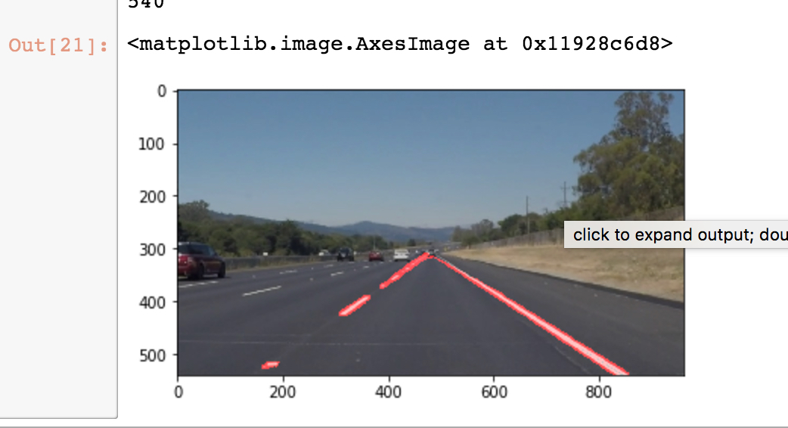
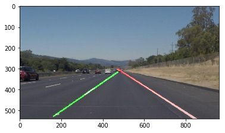

#**Finding Lane Lines on the Road** 

Overview
---

When we drive, we use our eyes to decide where to go.  The lines on the road that show us where the lanes are act as our constant reference for where to steer the vehicle.  Naturally, one of the first things we would like to do in developing a self-driving car is to automatically detect lane lines using an algorithm.

In this project you will detect lane lines in images using Python and OpenCV.  OpenCV means "Open-Source Computer Vision", which is a package that has many useful tools for analyzing images.  

# **Finding Lane Lines on the Road** 

Pipeline in making:

My Pipeline of the project consist of 6 steps
First: I read the sample file using solidWhiteRight.jpg as my reference image.
Second: I use the grascale method helper to read it, then I ran canny method to that gray scale image with low threshold of 80 and high threshold to 200 (I end up with those two values after playing with other parameters)
Third step:  I am transforming that cannied image into gaussian blur function with kernel_size of 5 (my final value)
Fourth step: I masked the cannied images with vertecies of [[470, 320],[490, 320],[900, 539],[100, 539]] later on I am planning to change dynamically with image size
Fifth step: I ran houghLine function with     rho = 2 theta = np.pi/180 threshold = 15 min_line_len = 20 and max_line_gap = 120
Six step would be superimposing image with the hough line.

result of pipeline prior to improvement in draw line:

Drawlines in making:

My Drawlines strategy is to separate the left and right lanes into two separate processes. 
first i am creating 2 pair of arrays one for Xs and Ys for the left street line, and another set for the right street line.
I am counting the slope to figure out, which one goes to left and which one goes to the right. I limit the slope as well
The idea is to use y=mx+b averaged calculation to draw the straight line for finding street line based on the averaged value 
Then, we perform polyfit for every x,y as we want to find vector coeficient first.
After vector coeficient are produced, now we want to build y=mx+b using poly1d function.
Now it's time to connecting the dot in between lines. first we sort it out (alligning the points from the lowest x to somewhere halfway in the image/ left to right fashion )
Then I repeat the process for the other half for the right line. at this time the connecting the dot is on the reverse 

result of improved draw line :

###  Shortcomings with my current pipeline 

One potential shortcoming would be what would happen when the road take a turn left and right, for some reason my line became unstable and change a lot of time.

Another shortcoming could be if the image size change. I found out the hard way when masking become dynamic number. I tried to dynamically create a trapezoid based on the image size, however I am totally fail at this one, and the line became to unstable:(

###  Possible Improvements 

A possible improvement would be to improve how I utilize y=mx+b. I was basically linearly stepping up the line 10 point at a time which might not the right way to do it and create instability in finding the correct slope line

Another potential improvement could be to utilize error table from polyfit and perform another regression to find better vector coeficient (drop out noisy data )
or maybe we can do 2nd order (curve equation instead of linear y=mx+b) since there are no such thing as perfect straight line in real life.

